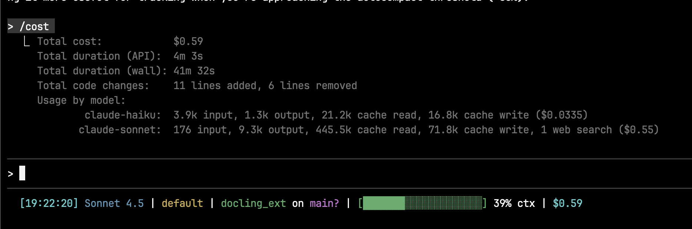

# Claude Code Statusline

A custom statusline script for [Claude Code](https://claude.com/claude-code) that provides accurate cost tracking and context usage warnings.

## Features

- **Accurate Cost Display**: Shows total session cost across all models (Opus, Sonnet, Haiku combined)
- **Context Usage Bar**: Visual progress bar with cache-based accuracy showing percentage and remaining tokens
- **Git Integration**: Shows current branch and status indicators (`*` uncommitted, `+` staged, `?` untracked)
- **Timestamp**: Current time for each update
- **Model & Style**: Shows active model and output style

## Screenshot



## Installation

### Prerequisites

- [Claude Code](https://claude.com/claude-code) installed
- `jq` for JSON parsing:
  ```bash
  # macOS
  brew install jq

  # Linux (Debian/Ubuntu)
  sudo apt install jq

  # Linux (Fedora)
  sudo dnf install jq
  ```

### Setup

1. **Download the script:**
   ```bash
   mkdir -p ~/.claude
   curl -o ~/.claude/statusline-command.sh https://raw.githubusercontent.com/jacob-bd/claude-code-statusline/main/statusline-command.sh
   chmod +x ~/.claude/statusline-command.sh
   ```

2. **Configure Claude Code** - add to `~/.claude/settings.json`:
   ```json
   {
     "statusLine": {
       "type": "command",
       "command": "bash ~/.claude/statusline-command.sh"
     }
   }
   ```

   Or if you already have settings, just add the `statusLine` block.

3. **Restart Claude Code** to apply changes.

## Customization

### Static Overhead (Fallback Only)

The script uses cache-based token counts for accurate context tracking. These cache tokens already include all overhead (system prompt, tools, MCPs), so no manual adjustment is needed for most interactions.

On the **first message** of a session (before any cache data exists), the script falls back to `input_tokens + STATIC_OVERHEAD`. The default value works for typical setups:

```bash
STATIC_OVERHEAD=53000  # Fallback only: used when cache data unavailable
```

You generally do not need to change this value. After the first exchange, the cache-based approach takes over automatically.

### Adjust Color Thresholds

Edit these lines to change when colors trigger:

```bash
if [[ $pct -lt 50 ]]; then
    color='\033[32m'  # green
elif [[ $pct -lt 75 ]]; then
    color='\033[33m'  # yellow
else
    color='\033[31m'  # red
fi
```

### Change Progress Bar Width

Modify `bar_width=20` to your preferred width.

## Limitations

### Context Bar Accuracy

The cache-based approach provides accurate context tracking for the vast majority of interactions. Cache tokens (`cache_creation_input_tokens` + `cache_read_input_tokens`) naturally include all overhead -- system prompt, tools, MCP servers, memory files, and custom agents -- so no manual estimation is required.

The only exception is the **first message** of a new session, before any cache data exists. In this case, the script falls back to `input_tokens + STATIC_OVERHEAD` (~53k), which is an approximation. After the first exchange, the cache-based approach takes over and accuracy improves significantly.

**Known issue:** There are [multiple open GitHub issues](https://github.com/anthropics/claude-code/issues/516) requesting Anthropic to expose total context usage in the statusline JSON. Upvote if you want this fixed properly!

### Calculating Your Own Overhead (Optional/Legacy)

The `STATIC_OVERHEAD` value is only used as a fallback for the first message of a session. The default of 53000 works for most setups. If you want to fine-tune it:

1. Run `/context` in Claude Code
2. Add up everything **except** Messages (system prompt, tools, MCP tools, custom agents, memory files)
3. Set your value in the script:
   ```bash
   STATIC_OVERHEAD=53000
   ```

This is optional -- the cache-based approach handles overhead automatically after the first exchange.

## How It Works

The script receives JSON input from Claude Code containing:
- `cost.total_cost_usd` - Accurate total cost across all models
- `context_window.current_usage` - Token usage breakdown (`input_tokens`, `cache_creation_input_tokens`, `cache_read_input_tokens`)
- `context_window.context_window_size` - Total context window (200k for most models)
- `workspace` - Directory information
- `model` - Active model info

**Dual-strategy context calculation:**

1. **Primary (cache-based):** Uses `cache_creation_input_tokens + cache_read_input_tokens`. These cache totals naturally include all overhead (system prompt, tools, MCP servers), giving accurate context usage without any manual estimation.

2. **Fallback (static overhead):** On the first message of a session, cache tokens are zero. The script falls back to `input_tokens + STATIC_OVERHEAD` (~53k) to approximate the full context.

The percentage is calculated against the full context window size to match `/context` output.

## Related Issues

- [#11535](https://github.com/anthropics/claude-code/issues/11535) - "Expose token usage data to statusline scripts" (canonical issue, still open)
- [#18944](https://github.com/anthropics/claude-code/issues/18944) - "Statusline API used_percentage significantly underreports" (source of cache-based workaround)
- [#516](https://github.com/anthropics/claude-code/issues/516) - "Always show available context percentage"
- [#14058](https://github.com/anthropics/claude-code/issues/14058) - "Include actual context window usage in statusline JSON"
- [#13776](https://github.com/anthropics/claude-code/issues/13776) - "Expose full context usage in statusline API"

## Vibe Coding Alert

Full transparency: this project was built by a non-developer using AI coding assistants. If you're an experienced shell scripter, you might look at this code and wince. That's okay.

The goal here was to scratch an itch - better cost and context tracking for Claude Code - and learn along the way. The code works, but it's likely missing patterns, optimizations, or elegance that only years of experience can provide.

## License

MIT License - feel free to modify and share!

## Contributing

Issues and PRs welcome. If you find ways to get more accurate context data from Claude Code, please share!
