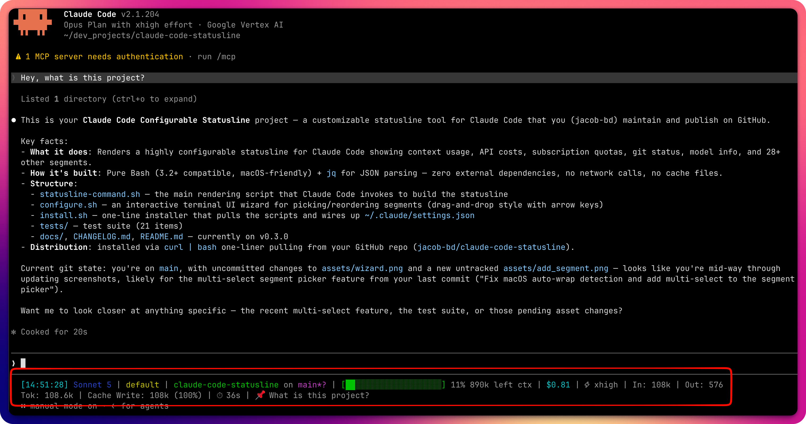
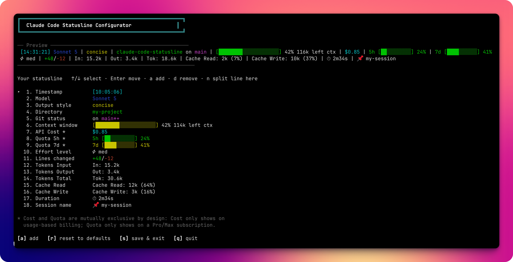

# Claude Code Configurable Statusline

[](https://buymeacoffee.com/jacobbd)


A highly customizable statusline for [Claude Code](https://claude.com/claude-code) with an interactive setup wizard. Displays accurate context usage, API costs, subscription quotas (5-hour and 7-day), and 20 other configurable segments.



For details on recent changes, see the [Changelog](CHANGELOG.md).

## Features

- **Interactive Setup Wizard**: Terminal UI to easily toggle and reorder segments.
- **Accurate Context & Quota Tracking**: Uses Claude Code's native JSON payload for exact context percentage and Pro/Max subscriber rate limits.
- **Smart Cost Display**: Automatically hides API costs if you're on a Claude subscription and have quota bars enabled.
- **Multi-line & Flex Layouts**: Build beautiful, right-aligned, multi-line status displays directly in your terminal.
- **33 Available Segments**: Choose from Model, Timestamp, Git, Token usage, Output Style, Effort, Quotas, PR Info, Cache Metrics, and more.
- **Zero Dependencies**: Pure `bash` (3.2+ compatible) and `jq`. No external network requests, no cache files.

## Installation

### Prerequisites

- [Claude Code](https://claude.com/claude-code) installed (v2.1.132+ recommended for native context percentage)
- `jq` for JSON parsing:
  - **macOS**: `brew install jq`
  - **Linux**: `sudo apt install jq` (Debian/Ubuntu) or `sudo dnf install jq` (Fedora)
  - **Windows**: `winget install jqlang.jq` or `choco install jq` or `scoop install jq`

### Setup

Run this one-line command in your terminal. It will download the scripts, update your Claude Code settings, and automatically launch the configuration wizard:

```bash
bash -c "$(curl -fsSL https://raw.githubusercontent.com/jacob-bd/claude-code-statusline/main/install.sh)"
```

*Note: Restart Claude Code after installation to apply the changes.*

### Uninstallation

To remove the custom statusline and revert Claude Code to its default behavior:

1. Open your Claude Code settings file: `~/.claude/settings.json`
2. Delete the entire `"statusLine"` block.
3. Restart Claude Code.
4. (Optional) Delete the scripts and config:
   ```bash
   rm ~/.claude/statusline-command.sh ~/.claude/configure.sh ~/.claude/statusline-config.json
   ```

## Configuration Wizard

Run the interactive wizard to choose which segments appear and in what order:

```bash
bash ~/.claude/configure.sh
```



### How it works
1. Use `↑`/`↓` to move the cursor through your enabled segments — they're listed in the exact order they'll appear in your statusline.
2. Press `Enter` on a segment to pick it up, then `↑`/`↓` to slide it to a new position; `Enter` or `Esc` drops it back in place.
3. Press `a` to add a new segment from the ones not yet enabled, `d` to remove the highlighted one, or `r` to reset to the defaults.
4. The live preview updates instantly and is generated by the same rendering code your real statusline uses — what you see is exactly what you'll get.
5. Press `s` to save your configuration to `~/.claude/statusline-config.json`, or `q` to quit without saving.

> [!TIP]
> **Handling Truncation (`..`)**: Claude Code keeps the status line on a single line and will automatically truncate it with `..` if it exceeds your terminal width. If your status line is getting cut off:
> 1. Run `configure.sh` and remove (`d`) less important segments (e.g., Output Style, Thinking, or Version).
> 2. Reduce the progress bar widths in your config file (see *Advanced Configuration* below).

### Available Segments

| Segment | Example | Description |
|---------|---------|-------------|
| **Timestamp** | `[10:05:06]` | Current local time |
| **Model** | `Sonnet 5` | Active model display name |
| **Effort level** | `⚡med` | Current reasoning effort level |
| **Output style** | `concise` | Active output style |
| **Directory** | `my-project` | Current directory (relative to workspace) |
| **Git status** | `on main*+` | Branch name and indicators (`*` uncommitted, `+` staged, `?` untracked) |
| **Context window** | `[████░░░░] 42% 114k left`| Context usage percentage and remaining tokens |
| **Context % only** | `Context: 42% 114k left` | Context usage percentage only (saves space) |
| **API Cost** \* | `$0.85` | Session total cost |
| **Quota 5h** \* | `5h [██░░] 24%` | Subscription 5-hour rolling rate limit (Pro/Max) |
| **Quota 5h % only** \* | `5h 24%` | Subscription 5-hour rate limit percentage only (saves space) |
| **Quota 7d** \* | `7d [████░░] 41%` | Subscription 7-day rate limit (Pro/Max) |
| **Quota 7d % only** \* | `7d 41%` | Subscription 7-day rate limit percentage only (saves space) |
| **Duration** | `⏱ 2m34s` | Total wall-clock session time (typing, tool use, and API calls combined) |
| **Lines changed** | `+48/-12` | Lines of code added/removed |
| **Session name** | `📌 my-session` | Custom session name |
| **Thinking** | `💭 on` | Extended thinking status |
| **Version** | `v2.1.200` | Claude Code version |
| **PR info** | `PR #42 ✓` | Open PR number and review status |
| **Flex spacer** | `<--->` | Dynamically pushes subsequent segments to the right margin |
| **New line** | `[NEWLINE]` | Splits the statusline onto a new terminal line |
| **Tokens Input** | `In: 15.2k` | Total input tokens |
| **Tokens Output** | `Out: 3.4k` | Total output tokens |
| **Tokens Cached** | `Cache: 12k` | Tokens read/created in cache this turn |
| **Tokens Total** | `Tok: 30.6k` | Total tokens (input + output) |
| **Cache Hit Rate** | `Cache Hit: 87.0%` | Prompt cache hit rate (cache reads vs. cache writes) |
| **Cache Read** | `Cache Read: 12k (64%)` | Cache read tokens served from cache, with % share of context |
| **Cache Write** | `Cache Write: 3k (16%)` | Cache write tokens written to cache, with % share of context |
| **Quota 5h Reset** \* | `⏳ resets in 2h5m` | Time remaining until the 5-hour rate limit window resets |
| **Quota 7d Reset** \* | `⏳ resets in 2d3h` | Time remaining until the 7-day rate limit window resets |
| **Vim Mode** | `🔵 NORMAL` | Current vim mode, shown when Claude Code's vim editor mode is enabled |
| **Git Worktree** | `🌳 feature-x` | Name of the current git worktree, if inside one |
| **API Duration** | `⏱ api 1m12s` | Time spent waiting on API responses (distinct from wall-clock Duration) |

\* **Cost vs. Quota**: these segments render based on your account type, so you'll typically only ever see one side. API Cost shows on usage-based billing; the Quota segments show only on a Claude Pro/Max subscription. Enabling both is fine — the inactive ones simply stay hidden, they aren't broken.

> [!TIP]
> **Vim Mode double-display**: if you enable the Vim Mode segment, also set `"hideVimModeIndicator": true` in your `statusLine` settings block to avoid Claude Code's built-in `-- INSERT --` indicator showing twice.

## Advanced Configuration

You can manually edit the config file at `~/.claude/statusline-config.json`:

```json
{
  "segments": [
    "timestamp",
    "model",
    "style",
    "newline",
    "directory",
    "git",
    "flex",
    "tokens_in",
    "tokens_out",
    "cost"
  ],
  "context_bar_width": 20,
  "bar_width": 10
}
```

The order of items in the `segments` array determines their display order from left to right.

- Insert `"newline"` to split the rendering onto a second line — it may appear more than once for a 3+ line layout.
- Insert `"flex"` to consume all remaining terminal width, pushing the segments that follow it to the right-hand margin — it may also appear more than once on the same line to distribute space across multiple gaps.

## Acknowledgments

The multi-line layout and `flex` spacer features were heavily inspired by the excellent [ccstatusline](https://github.com/macton/ccstatusline) project by @macton.

## License

MIT License - feel free to modify and share!
